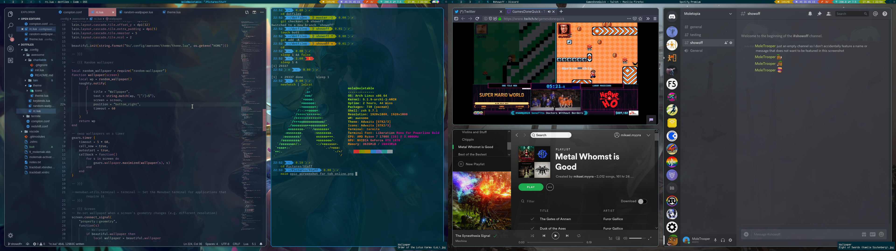

## Summary
This is my home computer setup aiming for pragmatic, keyboard-focused usage
while still looking awesome.

...

*pun intended*

## Screenshot

Wallpapers are selected randomly from my personal collection;
see bottom right notifications in the screenshot for credit.

## Credit
* window manager: [awesome](https://awesomewm.org/)
* theme based on [awesome-copycats](https://github.com/lcpz/awesome-copycats) powerline theme
* tag management with [charitable](https://github.com/frioux/charitable
)
* colors from [solarized](https://ethanschoonover.com/solarized/)
* compositor: [compton](https://github.com/yshui/compton)
* zsh theme: [powerlevel10k](https://github.com/romkatv/powerlevel10k)
